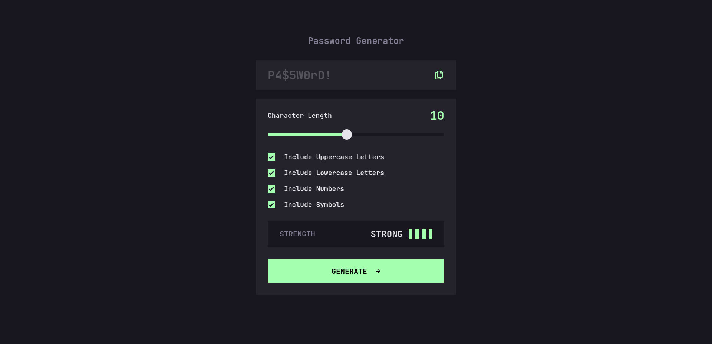

# Frontend Mentor - Password generator app solution

This is a solution to the [Password generator app challenge on Frontend Mentor](https://www.frontendmentor.io/challenges/password-generator-app-Mr8CLycqjh). Frontend Mentor challenges help you improve your coding skills by building realistic projects.

## Table of contents

- [Overview](#overview)
  - [The challenge](#the-challenge)
  - [Screenshot](#screenshot)
  - [Links](#links)
- [My process](#my-process)
  - [Built with](#built-with)
- [TODO](#todo)
- [How to run](#how-to-run)
- [How to test](#how-to-test)
- [How to build for production](#how-to-build-for-production)
- [Author](#author)

## Overview

### The challenge

Users should be able to:

- Generate a password based on the selected inclusion options
- Copy the generated password to the computer's clipboard
- See a strength rating for their generated password
- View the optimal layout for the interface depending on their device's screen size
- See hover and focus states for all interactive elements on the page

### Screenshot



### Links

- Solution URL: [GitHub](https://github.com/GrzywN/password-generator-app)
- Live Site URL: [Netlify](https://grzywn-password-generator-app.netlify.app/)

## My process

### Built with

- Semantic HTML5 markup
- CSS custom properties
- Flexbox
- Mobile-first workflow
- [TypeScript](https://www.typescriptlang.org/)
- [Vite](https://vitejs.dev/)
- [Vitest](https://vitest.dev/)
- [ESLint](https://eslint.org/)
- [Prettier](https://prettier.io/)
- [Figma](https://www.figma.com)

## TODO

- Improve clipboard behavior on copying empty password.
- Add ErrorBoundary and some kind of notifier. (Error state)
- Extract initial AppState to utils, make a wrapper for testing with it.
- Improve order of CSS properties, make a style guide for that.
- Improve shuffle() function and its specs.
- Improve solution based on FrontendMentor validator and other people's opinions.
- Write docs for the entire app flow and how it works.

## How to run

Run in development environment:
```bash
npm run dev
```

## How to test

Test once:
```bash
npm run test
```

Test in the watch mode:
```bash
npm run test:watch
```

## How to build for production

Make sure everything is fine:
```bash
npm run code:check
```

Build:
```bash
npm run build
```

Serve:
```bash
npm run serve
```

## Author

- Website - [karolbinkowski.me](https://karolbinkowski.me)
- Frontend Mentor - [@GrzywN](https://www.frontendmentor.io/profile/GrzywN)
- Twitter - [@GrzywN](https://www.twitter.com/GrzywN)
